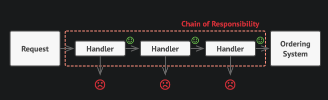

[<- Go Back](../README.md)

### Chain Of Responsibility

الگوی طراحی "Chain of Responsibility" یا زنجیره مسئولیت یکی از الگوهای 
رفتاری (Behavioral) است که به شما اجازه می‌دهد تا درخواست‌ها را از طریق زنجیره‌ای از دستگیره‌ها (handlers) ارسال کنید. هر دستگیره در این زنجیره تصمیم می‌گیرد که آیا می‌خواهد درخواست را پردازش کند یا آن را به دستگیره بعدی در زنجیره منتقل کند.

هدف اصلی این الگو جداسازی فرستنده‌ی درخواست از دریافت‌کننده‌ی نهایی است تا وابستگی بین آن‌ها کاهش یابد و امکان اضافه کردن، حذف یا تغییر ترتیب دستگیره‌ها بدون تغییر در فرستنده یا سایر دستگیره‌ها فراهم شود.

