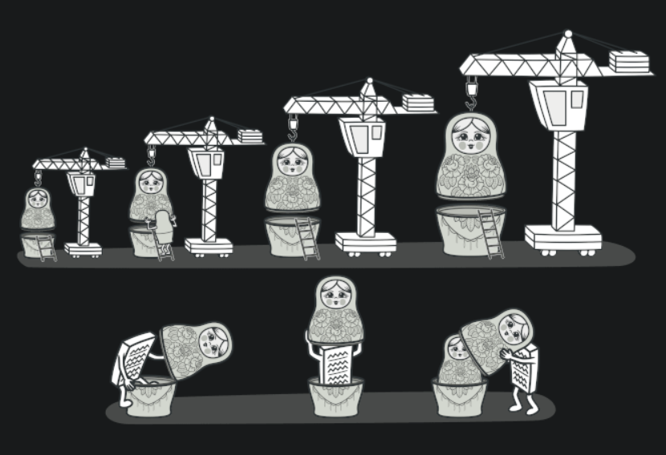

[<- Go Back](../README.md)

### Decorator

الگوی طراحی Decorator یکی از الگوهای ساختاری (Structural) در طراحی نرم‌افزار است که به شما اجازه می‌دهد تا به صورت پویا به اشیا قابلیت‌های جدید اضافه کنید، بدون این که کلاس آن‌ها را تغییر دهید. این الگو به شما امکان می‌دهد تا به جای ایجاد زیرکلاس‌های جدید برای هر ترکیب ممکن از قابلیت‌ها، از اشیای جداگانه استفاده کنید که می‌توانند به صورت ترکیبی به شیء اصلی اضافه شوند.

ساختار الگوی Decorator
الگوی Decorator شامل چهار بخش اصلی است:

* کامپوننت Component: یک اینترفیس یا کلاس انتزاعی که اشیا می‌خواهند از آن ارث ببرند یا آن را پیاده‌سازی کنند.

* آیتم ConcreteComponent: کلاس اصلی که قرار است قابلیت‌های جدید به آن اضافه شود.

* آیتم Decorator: یک کلاس انتزاعی که همان اینترفیس Component را پیاده‌سازی می‌کند و شامل یک مرجع به یک شیء Component است.

* آیتم ConcreteDecorator: کلاس‌های خاصی که قابلیت‌های جدید را به Component اضافه می‌کنند.

