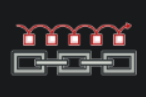
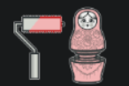

# php-design-pattern

### دیزاین پترن چیست ؟
دیزاین پترن‌ها (Design Patterns) الگوهای تکراری و استاندارد شده‌ای در طراحی نرم‌افزار هستند که برای حل مشکلات رایج در طراحی سیستم‌های نرم‌افزاری به کار می‌روند. این الگوها به توسعه‌دهندگان کمک می‌کنند تا بتوانند با استفاده از راه‌حل‌های اثبات‌شده و بهینه، مشکلات مشابه را با کارایی و کیفیت بالاتر حل کنند.

دیزاین پترن‌ها معمولاً به سه دسته‌ی اصلی تقسیم می‌شوند:

الگوهای ساختاری (Creational Patterns): این الگوها به ایجاد اشیا و نمونه‌ها در برنامه کمک می‌کنند و شامل مواردی مانند Singleton، Factory Method، Abstract Factory، Builder، و Prototype هستند.

الگوهای ساختاری (Structural Patterns): این الگوها به سازمان‌دهی کلاس‌ها و اشیا برای ایجاد ساختارهای بزرگ‌تر کمک می‌کنند. از جمله این الگوها می‌توان به Adapter، Bridge، Composite، Decorator، Facade، Flyweight، و Proxy اشاره کرد.

الگوهای رفتاری (Behavioral Patterns): این الگوها به تعاملات و ارتباطات بین اشیا و چگونگی رفتار آن‌ها می‌پردازند. از جمله این الگوها می‌توان به Chain of Responsibility، Command، Interpreter، Iterator، Mediator، Memento، Observer، State، Strategy، Template Method، و Visitor اشاره کرد.

هر دیزاین پترن با ارائه یک راه‌حل استاندارد به برنامه‌نویسان کمک می‌کند تا با استفاده از کدهای قابل باز استفاده، کدهای بهینه‌تر و قابل فهم‌تری بنویسند.

[**tips**](#tips)

### Behavioral Patterns

* 

* [Chain Of Responsibility ->](./ChainOfResponsibility/README.md)

### Structure Patterns

* 
* [Decorator ->](./Decorator/README.md)

## Tips

### Composition

مفهوم Composition (ترکیب)
Composition یا ترکیب، یکی از اصول طراحی شی‌ءگرا است که به جای استفاده از وراثت (Inheritance) برای ساختن رفتارهای جدید در کلاس‌ها، از اشیای دیگر استفاده می‌کند. در ترکیب، یک کلاس از اشیای کلاس‌های دیگر به عنوان اعضا یا خصوصیات خود استفاده می‌کند تا وظایف پیچیده‌تری را انجام دهد. این روش معمولاً نسبت به وراثت انعطاف‌پذیری بیشتری دارد و کدها را قابل نگهداری‌تر می‌کند.

مزایای Composition

انعطاف‌پذیری: ترکیب اجازه می‌دهد تا اشیا به راحتی ترکیب و تغییر 
داده شوند.

کاهش وابستگی‌ها: با ترکیب اشیا، وابستگی کمتری به کلاس‌های پایه وجود دارد و تغییر در یک کلاس تأثیری بر کلاس‌های دیگر ندارد.

اصل ترکیب بر وراثت (Favor Composition Over Inheritance): این اصل طراحی توصیه می‌کند که به جای وراثت که ممکن است منجر به کدهای پیچیده و سخت نگهداری شود، از ترکیب برای گسترش قابلیت‌ها استفاده کنید.

### Class Explosion

مفهوم Class Explosion (انفجار کلاس‌ها)

Class Explosion یا انفجار کلاس‌ها، یک مسئله در طراحی شی‌ءگرا است که به وجود تعداد زیادی کلاس کوچک و تخصصی اشاره دارد. این مشکل معمولاً در زمانی رخ می‌دهد که برای هر ترکیب ممکن از رفتارها و ویژگی‌ها، کلاس جدیدی ایجاد می‌شود. این مسئله می‌تواند مدیریت و نگهداری کد را دشوار کند و باعث پیچیدگی بی‌مورد در سیستم شود.

دلایل بروز Class Explosion

وراثت بیش از حد: استفاده زیاد از وراثت برای ایجاد زیرکلاس‌های جدید 
به منظور افزودن ویژگی‌ها و رفتارهای مختلف.

عدم استفاده از اصول طراحی مناسب: نادیده گرفتن اصولی مانند ترکیب بر وراثت و عدم استفاده از الگوهای طراحی مناسب.

مشکلات Class Explosion

پیچیدگی: تعداد زیادی کلاس باعث پیچیدگی در سیستم می‌شود و فهم و نگهداری کد را دشوار می‌کند.

نگهداری سخت: تغییر در یک کلاس ممکن است نیاز به تغییر در کلاس‌های متعدد دیگری داشته باشد.

عدم انعطاف‌پذیری: افزودن رفتارها و ویژگی‌های جدید نیاز به ایجاد کلاس‌های جدید بیشتری دارد که ممکن است منجر به پیچیدگی بیشتر شود.
جدیدجلوگیری از Class Explosion با استفاده از Composition
به جای ایجاد کلاس‌های متعدد با استفاده از وراثت، می‌توان از ترکیب برای افزودن ویژگی‌ها و رفتارهای جدید استفاده کرد. این کار با استفاده از الگوهای طراحی مانند Decorator، Strategy و سایر الگوها امکان‌پذیر است.

